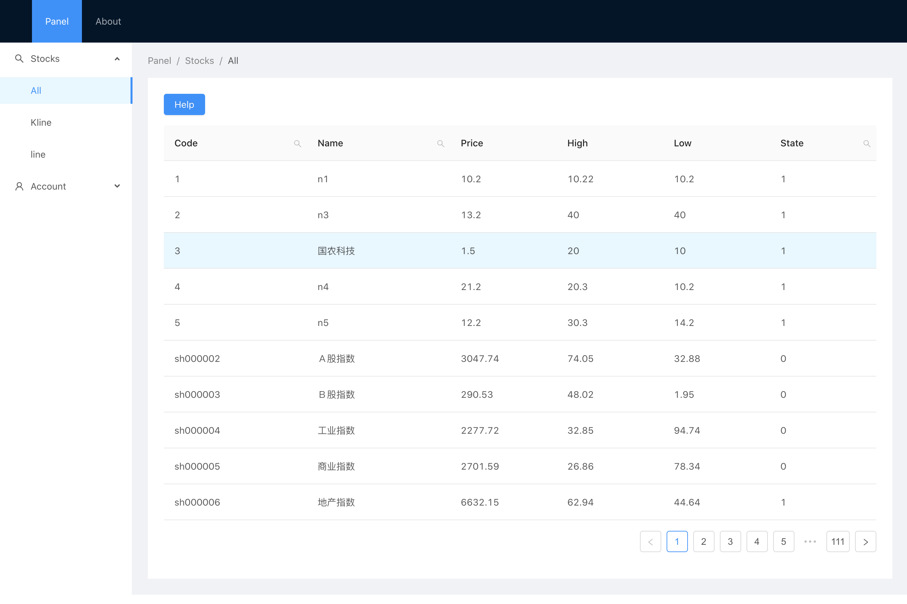

## Introduction

This web application reads and displays stock data in real-time.

## Get Started

In the root directory run

`yarn start`

or

`npm start`

## Screenshots

Display stock prices in database

### 

Seach stocks

### 

Display k-line (data from data base)

